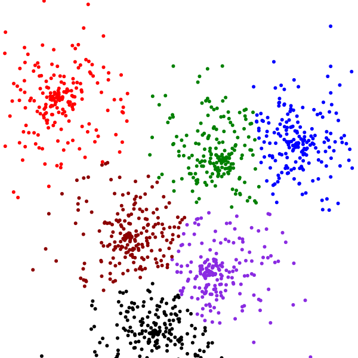

## Fizzle-Out

I think I'm about to abandon this project. My original goal was to see if I could use a .NET machine learning framework in Powershell.
I succeeded with a couple of caveats, but my current interest is in the ML itself, and I would rather continue in
a more common ML toolset like Python's sklearn rather than continue trying to shoehorn .NET libraries into Powershell.

It's been fun to prove it possible, but I'm just not motivated to make yet-another-ML-library with the unique feature of being Powershell-based.

## Dev Notes

An early attempt at using Accord Framework .NET machine learning library in Powershell.

I was able to download the library only and load it with `Add-Type`. I then adapted the
example C# K-Means code. The example methods `.Compute()` and `.Nearest()` are marked as
obsolete and point the reader to `.Learn()` and `.Decide()` instead.

`.Compute()` and `.Nearest()` still work. `.Learn()` throws an error, however I believe
it is working and then failing to enumerate/convert its output data to Powershell. The
cluster centroids are defined and subsequent `.Decide()` calls properly fit the datum
to the cluster.

## Files

- scratch.ps1 - My (successful) first attempt at implementing the [example code](http://accord-framework.net/docs/html/T_Accord_MachineLearning_KMeans.htm#ID8RBSection) in Powershell.
- scratch2.ps1 - Same as scratch.ps1 except using the recommended non-obsolete method calls. Throws and error on `.Learn()` but does what I need it to.
- ClusterTest2d.ps1 - I wanted a two-dimensional clustering exercise I could plot and ensure it's doing what I think it's doing. It is. Creates out.html as the cluster-colored scatter plot.
- ScatterPlot.html.template - I personally found it easier to use d3.js to do the scatter plot than to try to wrangle the .NET charting libraries, so ClusterTest2d uses this template, replaces a data variable, and then the out.html plot can be viewed in a browser. (I'm doing a lot of F5, tab, F5, view, alt-tab, repeat right now.) This file currently assumes a 100x100 plot area and no more than 7 clusters to color.
- TextClassifier.ps1 - After the 2D test I wanted to classify some text. This file is not generalized but with some work could be used for other data sets. It works, but it's not clustering my reddit comment bodies or titles as well as I hoped, but I think it's probably a poor data set for this algorithm. I'm losing steam on the project, otherwise I'd refactor the n-gram, featurized and tf-idf functions to be more independent.

## Example Output

A sample plot generated by ClusterTest2d.ps1 its out.html ([use this link if image is broken](exampleoutput/pskmeans2dtest.svg)):

